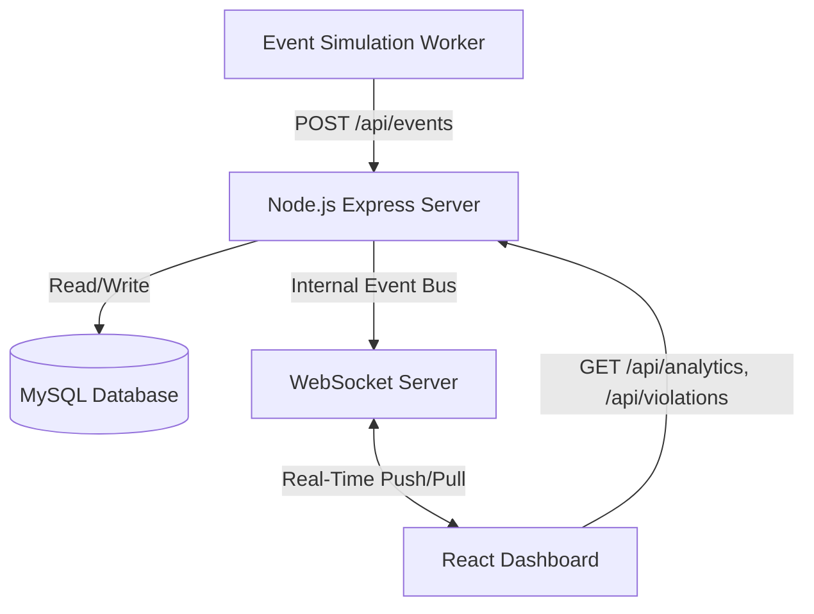

# Real-Time Fleet Monitoring Platform

## Phase 1 — Project Understanding

**Purpose of the System:**
The Real-Time Fleet Monitoring Platform is a dynamic solution designed to ingest, process, and display live telemetry and behavioral events from commercial fleet vehicles. It provides fleet managers with a real-time "control tower" view of their operations, allowing them to monitor driver safety, track vehicle anomalies, and respond to critical incidents instantly.

**How Real Dashcam Platforms Work:**
In real-world implementations, edge devices (dashcams) equipped with AI inferencing classify events locally (e.g., detecting a driver holding a phone, falling asleep, or swerving). These devices securely stream lightweight event payloads (JSON containing coordinates, severity, timestamp, and metadata) over cellular networks to a cloud ingestion pipeline, minimizing bandwidth while ensuring rapid response.

**How Simulated Events Mimic Real Telemetry:**
In this prototype, instead of hardware dashcams, a Node.js Background Worker generates artificial telemetry. This worker uses randomized algorithms bounded by realistic parameters (e.g., speed variations, randomized violation occurrences) to emit payloads formatted identically to those produced by physical edge devices, publishing them every 2–3 seconds.

**The Lifecycle of a Driver Event:**
1. **Generation:** An event (e.g., harsh braking) is triggered.
2. **Ingestion:** The event is transmitted via HTTP REST to the backend.
3. **Processing:** The backend validates the payload, updates overarching analytics (like risk score), and maps coordinates.
4. **Storage:** The event is persistently saved to a relational database (MySQL) for historical auditing and compliance.
5. **Distribution:** The backend immediately broadcasts the validated event to all connected dashboard clients via WebSockets.
6. **Visualization:** The React dashboard receives the event, flashes an alert if severe, updates sparkline charts, and prepends the live ledger.

**Why Real-Time Streaming is Required:**
Fleet management relies on immediate mitigation to prevent accidents or penalize extreme infractions. A delayed polling mechanism creates an unacceptable lag between a driver falling asleep and a dispatcher being able to intervene. WebSockets provide a persistent full-duplex connection for instantaneous, low-overhead message passing.

**Production Considerations for Scaling:**
For a production deployment spanning tens of thousands of vehicles:
- *Ingestion Layer:* Replace raw REST endpoints with high-throughput message brokers (Apache Kafka or AWS Kinesis).
- *Database Scaling:* Separate read and write workloads using read replicas. Implement Time-Series databases (e.g., TimescaleDB or InfluxDB) for high-frequency coordinate data, while maintaining MySQL/PostgreSQL for relational driver/trip data.
- *Microservices:* Isolate the ingestion pipeline, the analytics/aggregation engine, and the WebSocket distribution (using Redis Pub/Sub to scale socket instances) into autonomous microservices.

---

## Phase 2 — System Architecture

**Components & Roles:**
- **Event Generator (Background Worker):** Simulates device hardware, emitting randomized payloads periodically.
- **Backend API Server (Express.js):** Receives HTTP payloads, validates them, and writes to the DB. Exposes historical routes.
- **WebSocket Server (ws):** Maintains live TCP connections with the frontend to push live updates bidirectionally.
- **Database (MySQL):** The persistent ledger of truth, housing relational mappings of Drivers, Trips, and Events.
- **Frontend Dashboard (React/Vite):** Consumer of both REST data (initial load) and WebSocket updates (live stream), aggregating the data visually using ECharts and Tailwind.

**Interaction Flow:**
1. **Event Generator** (Worker) -> POST HTTP -> **Backend API Ingestion**
2. **Backend API Ingestion** -> INSERT -> **Database Storage**
3. **Backend API Ingestion** -> Emit -> **WebSocket Broadcast**
4. **WebSocket Broadcast** -> TCP Push -> **React Dashboard Updates**

---

## Phase 3 — Folder Structure & Scalability

The project implements a Modular Monolithic Architecture. This is highly scalable for a prototype because:
- **Separation of Concerns:** Routes, controllers, and services are decoupled.
- **Extensibility:** If analytics becomes computationally heavy, its dedicated `services` logic can be factored out into a separate microservice.
- **Maintainability:** Standard MVC-like conventions mean rapid onboarding for new engineers.

*(See actual filesystem for folder structure matching your prompt exactly).*

---

## Phase 11 — Architecture Diagram

An architecture diagram illustrates the flow from simulation to the user interface:



---

## Phase 12 — Setup Instructions

### Prerequisites
- Node.js (v18+)
- MySQL (v8.0+)

### 1. Database Setup
Execute the `database/schema.sql` file in your MySQL environment to provision the tables.

### 2. Backend Setup
```bash
cd backend
npm install
npm run dev
```

### 3. Frontend Setup
```bash
cd frontend
npm install
npm run dev
```

### 4. Running the Dashboard
Navigate to `http://localhost:5173` to see real-time updates as the backend worker pushes simulated dashcam data.

